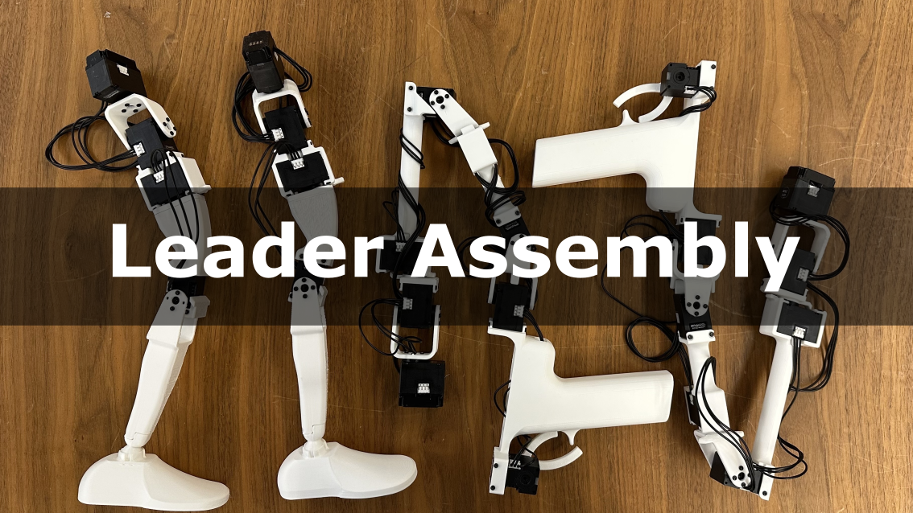
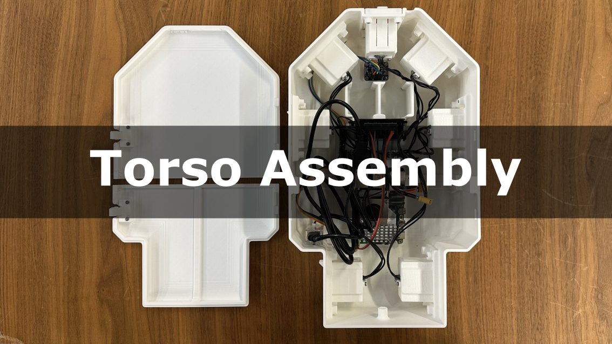

## Overview
<!-- For hardware components and assembly details, please refer to [hardware](./hardware/README.md).   -->
For software installation, please refer to [Teleop_Instruction](./Teleop_Instruction.md).

## Hardware 
All hardware componenents are listed in the [BOM](./hardware/BOM.md) 
### Leader Assembly
Assembly timelapse video [link](https://www.youtube.com/watch?v=je-I6776OQc)  
[](https://www.youtube.com/watch?v=je-I6776OQc)  
Note:
- Motor horns should stay in zero position during assembly
- XL330-M288-T motors are used for the joints
- XL330-M077-T motors are used for the grippers
- Motors come with two size of screws: M2x6mm, and M2x8mm. 
- M2x6mm screws are used to attach 3D prints to the motor horns.
- M2x8mm screws are to attached 3D prints to motor body

### Torso Assembly
Assembly timelapse video [link](https://youtu.be/dCdK7ieb7UU)  
[](https://youtu.be/dCdK7ieb7UU)
## To-Do
- \[✔️\] Release assembly guide.


## Citation
If you find this code useful in your research, please consider citing:
```
@INPROCEEDINGS{11203119,
  author={Myers, Noboru and Kwon, Obin and Yamsani, Sankalp and Kim, Joohyung},
  booktitle={2025 IEEE-RAS 24th International Conference on Humanoid Robots (Humanoids)}, 
  title={CHILD (Controller for Humanoid Imitation and Live Demonstration): A Whole-Body Humanoid Teleoperation System}, 
  year={2025},
  pages={1-6},
  }
```
